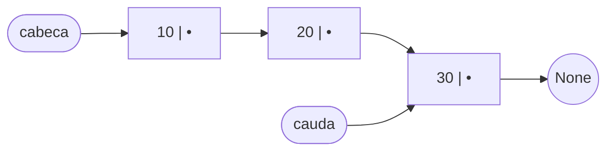
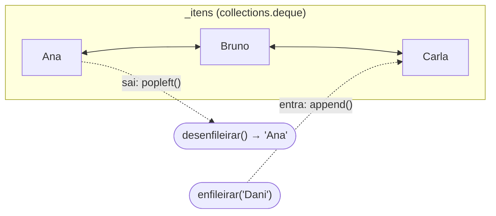

# Estruturas de dados encadeadas: Lista Encadeada e Fila

## Diagrama da estrutura encadeada

Cada nó (`No`) guarda um **valor** e uma referência para o **próximo** nó. A lista mantém referências para o primeiro nó (`cabeca`) e para o último (`cauda`); o último nó aponta para `None`.

## Diagrama da fila

A **Fila** é implementada com `collections.deque` (`_itens`), uma fila de duas pontas da biblioteca padrão do Python. A ponta esquerda é o início, de onde os elementos saem (`desenfileirar`, via `popleft`), e a ponta direita é o fim, onde entram (`enfileirar`, via `append`). É uma estrutura FIFO: o primeiro a entrar é o primeiro a sair.

Internamente, o `deque` é uma lista duplamente encadeada de blocos de tamanho fixo. Por isso, inserir ou remover em qualquer uma das pontas só ajusta referências, sem deslocar os demais elementos: ao sair Ana, Bruno simplesmente passa a ser o novo início, e tanto `enfileirar` quanto `desenfileirar` custam O(1).

## Análise simplificada de complexidade

*n* = quantidade de elementos na estrutura.

### Lista Encadeada

| Operação | Tempo | Motivo |
|---|---|---|
| `inserir_inicio` | O(1) | só ajusta a cabeça |
| `inserir_fim` | O(1) | graças à referência para a cauda |
| `inserir_posicao` | O(n) | precisa caminhar até a posição |
| `remover_inicio` | O(1) | só move a cabeça para o próximo nó |
| `remover` (por valor) | O(n) | precisa procurar o valor |
| `buscar` | O(n) | busca sequencial |
| `obter` (por índice) | O(n) | não há acesso direto por índice (em um array seria O(1)) |
| `inverter` | O(n) | percorre todos os nós uma vez |
| `len` / `vazia` | O(1) | contador atualizado a cada operação |
| **Espaço** | O(n) | um nó (valor + ponteiro) por elemento |

### Fila (FIFO)

| Operação | Tempo | Motivo |
|---|---|---|
| `enfileirar` | O(1) | `append` na ponta direita do deque |
| `desenfileirar` | O(1) | `popleft` na ponta esquerda, sem deslocar elementos |
| `espiar` | O(1) | acesso direto à ponta esquerda (`_itens[0]`) |
| `len` / `vazia` | O(1) | o deque já guarda o próprio tamanho |
| **Espaço** | O(n) | elementos guardados em blocos encadeados |

**Observação:** com uma `list` comum, desenfileirar via `pop(0)` custaria O(n), pois todos os elementos restantes seriam deslocados uma posição. O `deque` foi feito justamente para operações nas duas pontas e mantém `popleft()` em O(1). Já o acesso por índice no meio do deque (`_itens[i]`) é O(n), mas a fila não precisa dele.
